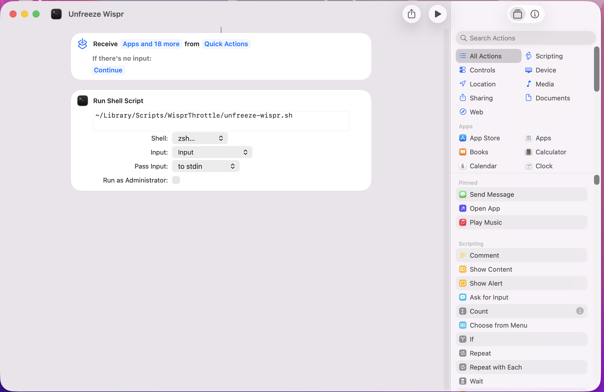

# Wispr Flow Auto-Throttle for macOS

Automatically throttle [Wispr Flow](https://wisprflow.ai/) when not in use to save CPU and battery. Wake it instantly with a Spotlight Quick Key.


## The Problem

Wispr Flow is a powerful AI voice dictation tool, but it's built on Electron and consumes significant system resources even when idle:

- **~800MB RAM** constantly
- **~8-11% CPU** even when not dictating
- Multiple background processes (10+ Electron helpers)
- Constant cloud connections and screen monitoring

This drains battery and heats up your Mac, even if you only dictate occasionally.

## The Solution

This tool automatically:

1. **Freezes Wispr Flow by default** - near-zero CPU when not in use
2. **Wakes instantly** - type `uw` in Spotlight (⌘Space)
3. **Auto-freezes after idle** - 5 minutes without dictation
4. **Smart activity detection** - checks Wispr logs for recent transcriptions

### CPU & Battery Savings

Tested on **MacBook Pro M4 Max (128GB RAM)**:

| State | CPU Usage | Impact |
|-------|-----------|--------|
| Normal (idle) | ~11% | Significant battery drain |
| **Frozen** | ~0% | Minimal impact |
| **Savings** | **~100%** | Extended battery life |

## Requirements

- **macOS Tahoe (26)** or later - uses Spotlight Quick Keys
- **[Wispr Flow](https://wisprflow.ai/)** installed

## Installation

### 1. Install Scripts

```bash
git clone https://github.com/ecsplendid/wispr-flow-throttle.git
cd wispr-flow-throttle
./install.sh
```

### 2. Create Spotlight Shortcuts

Open the **Shortcuts** app and create two shortcuts:

#### Unfreeze Wispr (`uw`)

1. Click **+** to create new shortcut
2. Add action: **Run Shell Script**
3. Paste: `~/Library/Scripts/WisprThrottle/unfreeze-wispr.sh`
4. Name it **"Unfreeze Wispr"**
5. In the sidebar, enable **"Show in Spotlight"**
6. Open Spotlight (⌘Space), search for "Unfreeze Wispr", right-click → **Add Quick Key** → type `uw`



#### Freeze Wispr (`fw`)

1. Create another shortcut
2. Add action: **Run Shell Script**
3. Paste: `~/Library/Scripts/WisprThrottle/freeze-wispr.sh`
4. Name it **"Freeze Wispr"**
5. Enable **"Show in Spotlight"**
6. Add Quick Key: `fw`

## Usage

| Action | How |
|--------|-----|
| **Wake Wispr** | ⌘Space → type `uw` → Enter |
| **Freeze Wispr** | ⌘Space → type `fw` → Enter |
| **Auto-freeze** | Happens automatically after 5 min idle |

## How It Works

Uses Unix signals (`SIGSTOP`/`SIGCONT`) to freeze and unfreeze Wispr Flow processes directly - no third-party tools required.

```
┌─────────────────┐     ┌──────────────────┐     ┌─────────────────┐
│  Spotlight      │────▶│  unfreeze.sh     │────▶│  kill -CONT     │
│  Quick Key: uw  │     │  (wake Wispr)    │     │  (resume procs) │
└─────────────────┘     └──────────────────┘     └─────────────────┘
                                │
                                │ writes timestamp
                                ▼
                        ┌──────────────────┐
                        │  ~/.wispr_last   │
                        │  (timestamp file)│
                        └──────────────────┘
                                ▲
                                │ checks every 15s
┌─────────────────┐     ┌──────────────────┐     ┌─────────────────┐
│  launchd        │────▶│  check-freeze.sh │────▶│  kill -STOP     │
│  (periodic)     │     │  + log detection │     │  (freeze procs) │
└─────────────────┘     └──────────────────┘     └─────────────────┘
```

### Smart Activity Detection

The check script monitors Wispr Flow's logs (`~/Library/Logs/Wispr Flow/main.log`) for recent transcription activity. If you've dictated something in the last 5 minutes, it won't freeze - even if you didn't explicitly wake it.

This means:
- You can dictate → walk away → dictate again within 5 min → no need to type `uw`
- Only after 5 minutes of complete inactivity does it freeze

## Configuration

### Timeout Duration

Default is 5 minutes. To change, edit the LaunchAgent:

```bash
nano ~/Library/LaunchAgents/com.local.wispr-freeze.plist
```

Change `WISPR_TIMEOUT` value (in minutes):
```xml
<key>WISPR_TIMEOUT</key>
<string>10</string>  <!-- 10 minutes -->
```

Reload:
```bash
launchctl unload ~/Library/LaunchAgents/com.local.wispr-freeze.plist
launchctl load ~/Library/LaunchAgents/com.local.wispr-freeze.plist
```

### Check Interval

Default is 15 seconds. Adjust `StartInterval` in the plist if needed.

## Uninstallation

```bash
./uninstall.sh
```

Then manually remove the Shortcuts you created.

## Design Decisions

### Why Direct Signals?

We use `SIGSTOP` and `SIGCONT` to freeze/unfreeze processes directly. This approach:
- Requires no third-party tools
- Has zero UI interaction (no visual artifacts)
- Works reliably on all macOS versions

### Why Spotlight Quick Keys?

We initially tried:
- **Karabiner-Elements** - Has [known issues](https://github.com/pqrs-org/Karabiner-Elements/issues/4265) with shell commands on M4 Macs
- **macOS Services** - Unreliable, shortcuts disappear after reboot

Spotlight Quick Keys (new in macOS Tahoe) are the most reliable option.

### Why Frozen by Default?

Wispr Flow uses significant CPU even when idle. By freezing it by default:
- Boot your Mac → Wispr starts frozen → zero battery drain
- Type `uw` only when you need to dictate
- Auto-freezes when you're done

## Troubleshooting

### Wispr not detecting audio after unfreeze

All Wispr processes should resume together. If issues persist, try:
```bash
~/Library/Scripts/WisprThrottle/unfreeze-wispr.sh
```

### Quick Keys not working

1. Ensure the Shortcut has "Show in Spotlight" enabled
2. Try searching the full name in Spotlight first
3. Re-add the Quick Key from Spotlight (right-click → Add Quick Key)

## Alternatives

If Wispr Flow's resource usage is unacceptable even with this tool:

| App | CPU Idle | Processing |
|-----|----------|------------|
| **Wispr Flow** | ~8-11% | Cloud |
| **Superwhisper** | Low | Local |
| **MacWhisper** | Low | Local |

## License

MIT License - see [LICENSE](LICENSE)

## Author

**Tim Scarfe** ([@ecsplendid](https://github.com/ecsplendid))

## Acknowledgments

- [Wispr Flow](https://wisprflow.ai/) for the excellent (if resource-hungry) dictation tool
- macOS Tahoe Spotlight Quick Keys for reliable hotkey triggering
